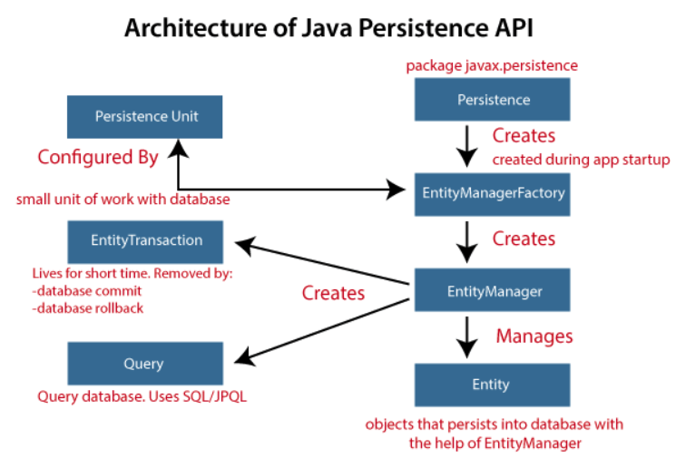

# Spring Notes

***

## Maven

* Project management tool

* Handle dependencies and building process of Java-based projects

* How Maven works

  1. Read config file

  2. Check local repo `.m2`

  3. Get from remote repo

  4. Save in local repo

* Standrad directory structure

  * `mvnw`
    * Allows you to run a Maven project
    * No need to have Maven installed or present on your path
    * If correct version of Maven is not found on the computer, it will automatically download it and run it
    * Two files are provided
      * `mvnw.cmd` for Windows
      * `mvnw.sh` for Unix-like
  * `pom.xml`
    * Maven config file
  * `src/main/java`
    * Java source code
  * `src/main/resources`
    * Properties / config files used by your app
  * `src/main/webapp`
    * JSP files and web config files, other web assets
    * DON'T use this directory if your package is packed as a JAR
    * Only work with WAR packaging 
  * `src/test`
    * Unit testing code and properties
  * `target`
    * Destination directory for compiled code
    * Automatically created by Maven

* `pom.xml`

  * **P**roject **O**bject **M**odel file
  * File structure
    * Project metadata
      * Project name, version, output file type, etc.
    * Dependencies
    * Plugins
      * Additional custom tasks to run

  * Project coordinates

    * Uniquely identify a project

    * ```xml
      <dependencies>
        <dependency>
            <!--Name of company, group, or organisation-->
            <groupId>org.hibernate.orm</groupId>
            <!--Name of the project-->
            <artifactId>hibernate-core</artifactId>		
            <version>6.1.4.Final</version>	
          </dependency>
        </dependencies>
      ```

* Maven archetype
  * Prototype `pom.xml`

***

## Spring Core

* Spring vs. Spring Boot
  * | Feature           | Spring Framework | Spring Boot |
  |------------------|----------------|------------|
  | **Definition** | A comprehensive framework for Java enterprise applications. | A framework built on top of Spring that simplifies application setup and development. |
  | **Configuration** | Requires a lot of manual XML or Java-based configuration. | Comes with auto-configuration to reduce boilerplate code. |
  | **Standalone Applications** | Needs an external server (e.g., Tomcat, Jetty) for deployment. | Embedded servers (Tomcat, Jetty, Undertow) allow applications to run standalone. |
  | **Dependency Management** | Requires developers to manually manage dependencies. | Provides "starters" (e.g., `spring-boot-starter-web`) to simplify dependency management. |
  | **Complexity** | More flexible but requires more setup and understanding of components. | Opinionated defaults make development faster and easier. |
  | **Microservices** | Can be used for microservices but requires additional configuration. | Designed with microservices in mind, making development smoother. |
  | **Production Readiness** | Requires additional setup for metrics, logging, and monitoring. | Includes built-in support for monitoring, metrics, and externalized configuration. |

* Write code as POJOs (Plain Old Java Objects)

### Spring Beans

* A Spring Bean is simply a Java object created and managed by Spring IoC container

* Why do we need Beans?

  * Without Spring Beans, developers must manually create and manage objects, leading to tight coupling
  * Spring Beans allow dependencies to be injected instead of instantiated inside a class, which enables loose coupling, easier unit testing, and better code reusability

* How to create bean

  * XML-based configuration

    * ```xml
      <!--/src/main/resources/spring.xml-->
      <bean id="laptop" class="com.example.Laptop" scope="singleton"/>
      ```

    * ```java
      // src/main/java/com.example/App.java
      ApplicationContext context = new ClassPathXmlApplicationContext("spring.xml");
      Laptop l1 = (Laptop) context.getBean("laptop");
      // or
      Laptop l2 = context.getBean(Laptop.class);
      ```

  * Java-based configuration

    * ```java
      // src/main/java/com.example/config/AppConfig.java
      
      @Configuration
      public class AppConfig {
        
        // the name of the bean is the method name by default
        @Bean(name={"machine1", "beast"})
        @Scope("prototype")
        public Laptop laptop() {
          return new Laptop();
        }
      }
      ```

    * ```java
      // src/main/java/com.example/App.java
      ApplicationContext context = 
        new AnnotationConfigApplicationContext(AppConfig.class);
      Laptop l = context.getBean(Laptop.class);
      ```

  * Component scanning

    * Stereotype annotations

      * | Annotation        | Description                                                  |
        | ----------------- | ------------------------------------------------------------ |
        | `@Component`      | Generic stereotype for any Spring-managed bean.              |
        | `@Service`        | Specialized for **service layer** components (business logic). |
        | `@Repository`     | Specialized for **DAO (Data Access Object) layer** (database interactions). |
        | `@Controller`     | Specialized for **web controllers** in Spring MVC.           |
        | `@RestController` | Combines `@Controller` and `@ResponseBody` for REST APIs.    |

    * ```java
      @Component
      @Scope("prototype")
      public class Laptop {}
      ```

    * ```java
      @SpringBootApplication
      public class SpringBootDemoApplication {
        public static void main(String[] args) {
          ApplicationContext context = 
            SpringApplication.run(SpringBootDemoApplication.class, args);
          Laptop l = context.getBean(Laptop.class);
        }
      }
      ```

    * Spring automatically **scans packages** for stereotype annotations using `@ComponentScan`
    
    * `@SpringBootApplication` is a convenience annotation that adds all of the following:
    
      - `@Configuration`: Tags the class as a source of bean definitions for the application context
      - `@EnableAutoConfiguration`: Tells Spring Boot to start adding beans based on classpath settings, other beans, and various property settings. For example, if `spring-webmvc` is on the classpath, this annotation flags the application as a web application and activates key behaviors, such as setting up a `DispatcherServlet`
      - `@ComponentScan`: Tells Spring to look for other components, configurations, and services in the `com/example` package, letting it find the controllers
    

* Scope

  * Singleton
    * By default beans are singleton scope
  * Prototype
    * A new instance is created everytime it is requested
  * Request 
    * A new instance is created for each HTTP request (Web Applications)
  * Session
    * A new instance is created per HTTP session
  * Application
    * A single instance shared across the entire web application

* Beans can be initialised lazily when they are created not at application startup but only when they are first needed

  * XML-based Config

    * ```xml
      <bean id="laptop" class="com.example.Laptop" lazy-init="true"/>
      ```

  * Java-based Config

    * ```java
      @Configuration
      public class AppConfig {
        
        @Bean
        @Lazy
        public Laptop laptop() {
          return new Laptop();
        }
      }
      ```
  
  * When to use lazy initialisation
  
    * The bean is **rarely used**
    * The bean is **resource-heavy** (e.g., database connections, third-party APIs)
    * You want **faster application startup**


### Inversion of Control

* Focusing on business logic instead of managing objects (creating, maintaining, destroying) as a programmer
* Spring IoC container takes care of it
* It is a Spring principle

### Dependency Injection

* In order to achieve IoC we use this design pattern DI

#### Construction Injection

* It is the recommended approach for injecting **mandatory dependencies** because it ensures that an object is always created with its required dependencies

* Steps

  1. Spring creates an instance of the dependent class
  2. It injects dependencies via the constructor
  3. The bean is then ready for use

* XML-based Config

  * ```xml
    <bean id="laptop" class="com.example.Laptop">
      <!--Must follow the sequence in the parameter list of the constructor-->
      <!--primitive fields-->
    	<constructor-arg name="price" value="100"/>
      <!--references-->
      <constructor-arg name="compiler" ref="compiler"/>
      
      <!--Or use index-->
      <constructor-arg index="1" ref="compiler"/>
      <constructor-arg index="0" value="100"/>
    </bean>
    
    <bean id="compiler" class="com.example.Compiler"/>
    ```

* Java-based Config

  * ```java
    @Configuration
    public class AppConfig {
      
      @Bean
      public Compiler compiler() {
        return new Compiler();
      }
      
      @Bean
      public Laptop laptop(Compiler compiler) {
        return new Laptop(compiler);
      }
    }
    ```


#### Setter Injection

* It allows Spring to inject beans after object creation

* Steps

  1. Spring creates an instance of the dependent class
  2. It injects dependencies using setter methods
  3. The bean is then ready for use

* XML-based Config
  * ```xml
    <bean id="laptop" class="com.example.Laptop">
      <!--primitive fields-->
    	<property name="price" value="100"/>
      <!--references-->
      <property name="compiler" ref="compiler"/>
    </bean>
    
    <bean id="compiler" class="com.example.Compiler"/>

* Java-based Config

  * ```java
    @Configuration
    public class AppConfig {
      
      @Bean
      public Compiler compiler() {
        return new Compiler();
      }
      
      @Bean
      public Laptop laptop(Compiler compiler) {
        Laptop l = new Laptop();
        l.setCompiler(compiler);
        return l;
      }
    }
    ```

* | **Use Setter Injection When...**                             | **Use Constructor Injection When...**                        |
  | ------------------------------------------------------------ | ------------------------------------------------------------ |
  | Dependency is **optional** (not always needed).              | Dependency is **mandatory** for the object to function.      |
  | You want to allow **modification after object creation**.    | You want to ensure **immutability** (no changes after construction). |
  | The class has **many dependencies**, making constructor injection harder to manage. | The class has **few dependencies**, making constructor injection clearer. |

* **It is not recommended to use both Constructor Injection and Setter Injection for the same field in a Spring Bean**

* if you define both Constructor Injection and Setter Injection for the same field, Spring will prioritize **Constructor Injection** if both are present

#### Autowiring

* Autowiring is a mechanism that automatically injects dependencies into Spring Beans, reducing the need for manual bean wiring in configuration files

* XML-based Config

  * ```java
    class Student {
      private Computer computer;
    }
    
    interface Computer {}
    class Laptop implements Computer {}
    class Desktop implements Computer {}
    ```

  * ```xml
    <!--Autowiring by name-->
    <!--Works when the bean name matches the field name-->
    <bean id="computer" class="com.example.Laptop"/>
    <bean id="Student" class="com.example.Student" autowire="byName"/>
    <!--The field must be named computer in Student-->
    ```

  * ```xml
    <!--Autowiring by type-->
    <!--Injects a bean if only one bean of that type exists-->
    <!--Set a primary bean when there is a conflict-->
    <bean id="laptop" class="com.example.Laptop" primary="true"/>
    <bean id="desktop" class="com.example.Desktop"/>
    <bean id="Student" class="com.example.Student" autowire="byType"/>
    <!--The field must be named computer in Student-->
    ```

* Java-based Config

  * ```java
    @Configuration
    public class AppConfig {
      
      @Bean
      @Primary
      public Laptop laptop() {
        return new Laptop();
      }
      
      @Bean 
      public Desktop desktop() {
        return new Desktop();
      }
      
      @Bean
      public Student student(@Qualifier("desktop") Computer computer) {
        return new Student(computer);
      }
    }
    ```

* Spring Boot Style

  * ```java
    @Component
    public class Student {
      // Field injection (least recommended)
      @Autowired
      private Card IdCard;
      private final Computer computer;
      private Bag bag;
      
      // Constructor injection
      @Autowired
      public Student(@Qualifier("laptop") Computer computer) {
        this.computer = computer;
      }
      
      // Setter injection
      // If a dependency may not always be available, set required = false
      // If no bean is found, Spring will not throw an error
      @Autowired(required = false)
      public void setBag(Bag bag) {
        this.bag = bag;
      }
    }
    ```


***

## Spring Boot Web

### Servlet (Old way)

* A Servlet is a Java-based server-side class used to handle requests and generate dynamic responses for web applications

* The servlet must be run on the servlet container (e.g., Apache Tomcat) instead of directly on JVM

* External or embedded server

* Servlet lifecycle

  * Loading and initialisation
    * When a servlet is requested for the first time or after a container restart, the servlet container loads the servlet class into memory
    * The container calls the `init()` method, which is used to initialize the servlet
    * `init()` is called only once during the servlet’s lifecycle and is used to perform any initializations required for the servle
  * Request handling
    * `service()` method is called for each request made to the servlet
    * It is responsible for processing the client request and generating the response
    * The container calls `service()` whenever it receives an HTTP request (usually via `doGet()`, `doPost()`, etc.)
    * In the case of `HttpServlet`, the `service()` method delegates the request to specific methods based on the HTTP method (GET, POST, etc.):
      - **`doGet()`**: Handles HTTP GET requests (commonly used for retrieving data from the server).
      - **`doPost()`**: Handles HTTP POST requests (commonly used for submitting data to the server).
      - **`doPut()`, `doDelete()`**: Handle PUT and DELETE requests, respectively.
      - **`doHead()`, `doOptions()`**: Handle other HTTP request types like HEAD and OPTIONS.
  * Destroying the servlet
    * When the servlet container decides to unload the servlet (typically when the server shuts down or the servlet is no longer needed), it calls the `destroy()` method
    * his is where cleanup tasks such as releasing resources (like database connections or file handles) should be done

* How to create a servlet?

  1. Extend `HttpServlet`
  2. Override `doGet()`, `doPOst()`, etc.
  3. Configure using `web.xml` or `WebServlet` annotation

* ```java
  import java.io.IOException;
  import javax.servlet.ServletException;
  import javax.servlet.annotation.WebServlet;
  import javax.servlet.http.HttpServlet;
  import javax.servlet.http.HttpServletRequest;
  import javax.servlet.http.HttpServletResponse;
  
  // Annotation-based servlet mapping
  @WebServlet("/hello")
  public class HelloServlet extends HttpServlet {
      
      @Override
      public void init() throws ServletException {
          System.out.println("Servlet Initialized");
      }
    
    	@Override
      protected void doGet(HttpServletRequest request, HttpServletResponse response) 
              throws ServletException, IOException {
          response.setContentType("text/html");
          response.getWriter().println("<h1>Hello, Servlet!</h1>");
      }
    
    	@Override
    	protected void doPost(HttpServletRequest request, HttpServletResponse response) 
        			throws ServletException, IOException {
          // Handle POST request
          String data = request.getParameter("data");
          response.getWriter().write("Received POST data: " + data);
  		}
    
    	@Override
      public void destroy() {
          System.out.println("Servlet Destroyed");
      }
  }
  ```

### Spring MVC with Spring Boot

* MVC (Model-View-Controller)
  * **Controller**
    * Maps HTTP requests to specific handler methods
    * Validates input data (optional, but often delegated to validation mechanisms)
    * Calls the service layer for business logic execution
    * Returns responses (JSON, XML, View)
    * Servlet, Spring MVC Controller
  * **Model**
    * **`@Service`**
      * Implements business logic
      * Calls data access layer (repository/DAO)
      * Ensures transaction management (e.g., `@Transactional`)
      * Provides reusable methods for controllers
    * **`@Component`**
      * Representing and managing application data
    * **`@Repository`**
      * Interacting with the database
      * Spring JDBC, Hibernate, Spring Data JPA, etc.
  * **View**
    * Displays data received from the Controller
    * UI presentation
    * JSP, Thymeleaf, React, Angular, etc.

* Spring Boot MVC has an embedded Tomcat server

* Work flow

  * ```css
    [Client] → [DispatcherServlet] → [Controller] → [Service] → [DAO] → [Database]
                  ↓
          [View Resolver] → [View]
    ```

* Annotations

  * | Annotation                 | Description               |
    | -------------------------- | ------------------------- |
    | `@Controller`              | Defines a web controller. |
    | `@RestController`          | Handles RESTful APIs.     |
    | `@RequestMapping("/path")` | Maps request URLs.        |
    | `@GetMapping("/path")`     | Maps GET requests.        |
    | `@PostMapping("/path")`    | Maps POST requests.       |
    | `@PutMapping("/path")`     | Maps PUT requests.        |
    | `@DeleteMapping("/path")`  | Maps DELETE requests.     |
    | `@RequestParam`            | Gets request parameters.  |
    | `@PathVariable`            | Extracts values from URL. |
    | `@ResponseBody`            | Sends data as JSON.       |

* Controller for view (skipped)

  * `ModelAndView` class
  * JSP is a servlet in the end


### REST API

* **RE**presentational **S**tate **T**ransfer

* [REST API written by Postman](https://blog.postman.com/rest-api-examples/)

* A key difference between a traditional MVC controller and the RESTful web service controller shown earlier is the way that the HTTP response body is created

* Rather than relying on a view technology to perform server-side rendering of the greeting data to HTML, this RESTful web service controller populates and returns an object. The object data will be written directly to the HTTP response as JSON

* `jackson` library converts Java objects to JSON

* ```java
  @RestController
  @RequestMapping("/posts")		// Base URL for all endpoints
  @CrossOrigin(origins = "http://localhost:3000")
  public class JobController {
  
      private JobService service;
  
      @Autowired
      public JobController(JobService service) {
          this.service = service;
      }
  
      public JobController() {
      }
  
      @GetMapping
      public List<JobPost> getAllJobs() {
          return service.getAllJobs();
      }
  
      // You can specify which format you want to produce or consume
      @GetMapping(path = "/{postId}", produces = {"application/json"})
    	// @PathVariable indicates that a method parameter should be bound to a URI template variable
    	// If the path variable name is the same as the parameter name, you don't have to specify it
      public JobPost getJobById(@PathVariable int postId) {
          return service.getJobById(postId);
      }
  
      @PostMapping(consumes = {"application/json"})
      public JobPost addJob(@RequestBody JobPost job) {
          service.addJob(job);
          return job;
      }
  
      // @RequestBody read the request body and deserialised it into an Object
    	@PutMapping("/{postId}")
      public JobPost updateJob(@RequestBody JobPost job) {
          service.updateJob(job);
          return service.getJobById(job.getPostId());
      }
  
      // @RequestParam binds the value of the query String parameter into the method parameter
    	// If the query parameter is absent in the request, then defaultValue is used
    	// Type conversion is automatically applied if the target method parameter type is not String
    	// If the conversion is falied, then respond bad request
    	@DeleteMapping
      public void deleteJob(@RequestParam(name = "id", defaultValue = "1") int jobId) {
          service.deleteJob(jobId);
      }
  }
  ```

* 


***

## Spring JDBC

* Spring JDBC is a lightweight module in the Spring Framework that simplifies database interaction using JDBC
* For larger applications, Spring Data JPA (with Hibernate) might be preferable, but for simple use cases, Spring JDBC is lightweight and efficient

### Key Components 

* `DataSource`

  * A `DataSource` object provides database connection pooling

  * Instead of creating a new connection for every request, Spring uses a connection pool to reuse existing connections efficiently

  * ```properties
    # application.properties
    spring.datasource.url=jdbc:mysql://localhost:3306/mydb
    spring.datasource.username=root
    spring.datasource.password=secret
    spring.datasource.driver-class-name=com.mysql.cj.jdbc.Driver
    spring.datasource.hikari.maximum-pool-size=10
    ```

  * ```java
    // or programmatically using DataSource
    @Bean
    public DataSource getDataSource() {
        HikariDataSource dataSource = new HikariDataSource();
        dataSource.setDriverClassName("com.mysql.cj.jdbc.Driver");
        dataSource.setJdbcUrl("jdbc:mysql://localhost:3306/mydb");
        dataSource.setUsername("root");
        dataSource.setPassword("secret");
        return dataSource;
    }
    ```

* `JdbcTemplate`

  * `JdbcTemplate` is the core class in Spring JDBC that provides methods to execute SQL queries. It internally manages:
    * Connection establish
    * Statement preparation
    * Query execution
    * Exception handling
    * Resource cleanup

### CRUD Operations

* Insert

  * ```java
    public void save(Employee e) {
        String sql = "INSERT INTO employees (id, name, department) VALUES (?, ?, ?)";
        jdbcTemplate.update(sql, e.getId(), e.getName(), e.getDepartment());
    }
    ```

* Select

  * A `RowMapper` is used to map database rows to Java objects

  * `RowMapper` is a functional interface with an abstract method `T mapRow(ResultSet rs, int rowNum)`

  * ```java
    public List<Student> findAll() {
        String sql = "select * from student";
        public class StudentRowMapper implements RowMapper<Student> {
          @Override
          public Student mapRow(ResultSet rs, int rowNum) throws SQLException {
              Student student = new Student();
              student.setRollNo(rs.getInt("rollno"));
              student.setName(rs.getString("name"));
              student.setMarks(rs.getInt("marks"));
              return student;
          }
      	}
    
        return jdbc.query(sql, new StudentRowMapper());
    }
    ```

    ```java
    // lambda expression
    public List<Student> findAll() {
        String sql = "select * from student";
        return jdbc.query(sql, (rs, rowNum) ->
                new Student(rs.getInt("rollno"),
                            rs.getString("name"),
                            rs.getInt("marks"))
        );
    }
    ```

    ```java
    // query for one object
    public Student find(int no) {
        String sql = "select * from student where rollno = ?";
        return jdbc.queryForObject(sql, (rs, rowNum) ->
                new Student(rs.getInt("rollno"),
                        rs.getString("name"),
                        rs.getInt("marks")),
                no);
    }
    ```

* Update

  * ```java
    public void update(int id, String name, String department) {
        String sql = "UPDATE employees SET name = ?, department = ? WHERE id = ?";
        jdbcTemplate.update(sql, name, department, id);
    }
    ```

* Delete

  * ```java
    public void delete(int id) {
        String sql = "DELETE FROM employees WHERE id = ?";
        jdbcTemplate.update(sql, id);
    }
    ```

### Transaction Management

* `@Transactional`

### Exception Handling

* Spring JDBC translates `SQLExceptions` into **`DataAccessException`**, which is a runtime exception hierarchy

* | Exception                                | Description                                           |
  | ---------------------------------------- | ----------------------------------------------------- |
  | `DataAccessException`                    | Root exception for Spring JDBC                        |
  | `EmptyResultDataAccessException`         | Thrown when `queryForObject()` returns no result      |
  | `IncorrectResultSizeDataAccessException` | Thrown when an unexpected number of rows are returned |

***

## Spring Data JPA

### JPA

* Java Persistence API
  * JPA is a Java **specification** that provides an ORM framework to manage data in Java application
  * The common interface for different providers like Hibernate, ExlipseLink, etc.
* JPA architecture
  * 

### Spring Data JPA

* Spring Data JPA is built as an abstract layer over the JPA
* It has all features of JPA plus the Spring ease of development
* [JPA vs. Spring Data JPA](https://www.baeldung.com/spring-data-jpa-vs-jpa)
* For years, developers have written boilerplate code to create a JPA DAO for basic functionalities. Spring helps to significantly reduce this amount of code by providing minimal interfaces and actual implementations
* Spring Data JPA uses Hibernate under the hood
* How to use Spring Data JPA?
  1. a
* Spring Data JPA creates a bunch of `findBy_` methods for you behind the scene when you specify them in the `@Repository` without specifying `@Query`
* 


